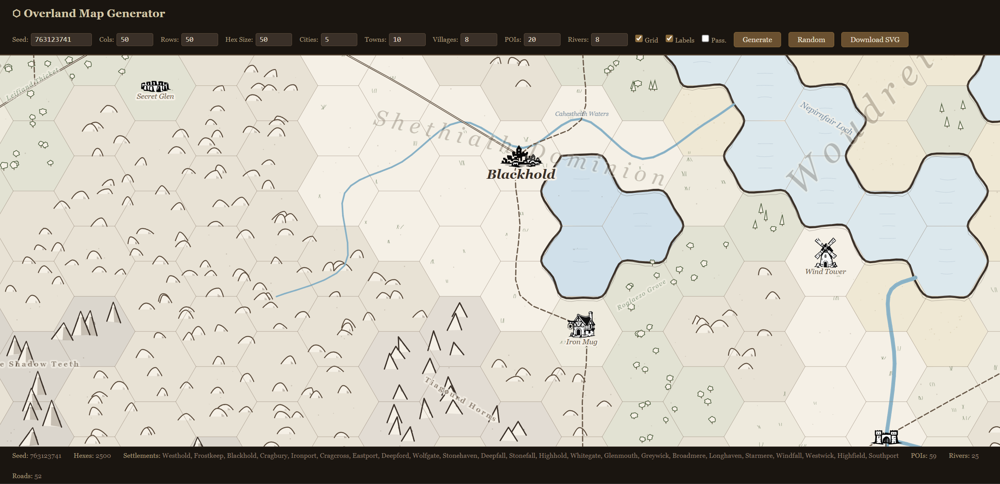

# Overland Map Generator

Procedural hand-drawn overland hexcrawl map generator using SVG.

Generates fantasy-style hex maps with terrain, settlements, roads, rivers, and points of interest — all rendered as stylized SVG with a hand-drawn aesthetic.



## Features

- Procedural terrain generation (plains, forests, mountains, hills, desert, swamp, water)
- Settlements: cities, towns, and villages with named labels
- Points of interest: ruins, caves, towers, temples, and more
- Roads connecting settlements with passability overlays
- Rivers and coastlines
- Deterministic output via seed-based RNG
- 80+ hand-drawn SVG icons
- Fully client-side — no server required

## Quick Start

Open `index.html` in a browser to use the interactive generator.

## Installation

```bash
npm install github:AdamGMiller/overland-map-generator
```

## Usage as a Library

```js
import { OverlandMap } from "overland-map-generator";

const map = new OverlandMap({
  seed: 42,
  cols: 16,
  rows: 12,
  hexSize: 50,
});

// Get SVG string
const svg = map.toSVG();

// Or render to DOM (browser)
document.body.appendChild(map.render());
```

### Options

| Option            | Type    | Default | Description                          |
| ----------------- | ------- | ------- | ------------------------------------ |
| `seed`            | number  | random  | Random seed for deterministic output |
| `cols`            | number  | 50      | Number of hex columns                |
| `rows`            | number  | 50      | Number of hex rows                   |
| `hexSize`         | number  | 50      | Pixel radius per hex                 |
| `showHexGrid`     | boolean | true    | Show hex grid overlay                |
| `showLabels`      | boolean | true    | Show settlement/POI labels           |
| `showPassability` | boolean | false   | Show passability overlay             |
| `waterRatio`      | number  | 0.25    | Fraction of map that is water        |
| `mountainRatio`   | number  | 0.12    | Fraction of map that is mountains    |
| `forestDensity`   | number  | 0.35    | Forest density factor                |
| `numCities`       | number  | 5       | Number of cities                     |
| `numTowns`        | number  | 10      | Number of towns                      |
| `numVillages`     | number  | 8       | Number of villages                   |
| `numPOIs`         | number  | 20      | Number of points of interest         |
| `numRivers`       | number  | 8       | Number of rivers                     |

## License

[MIT](LICENSE)
